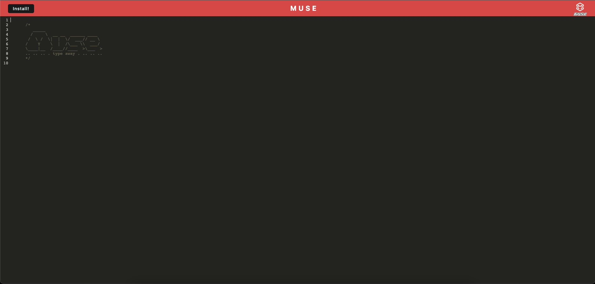
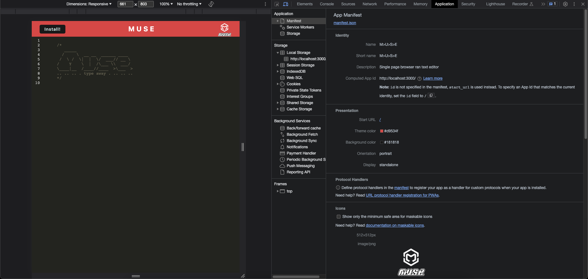
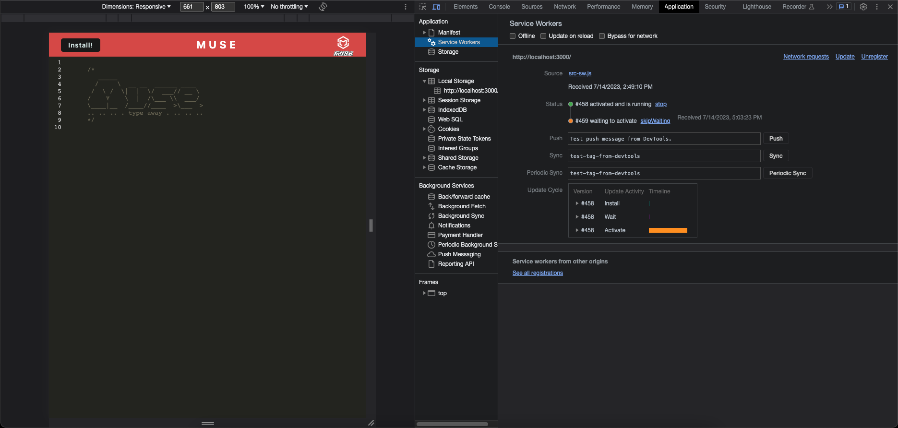
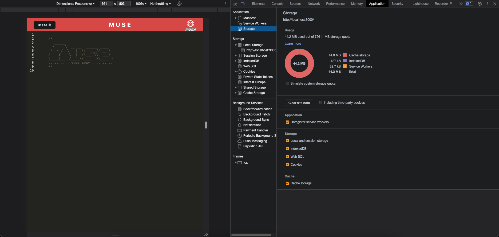

# < MUSE-Text-Editor >  

## Description
MUSE is a single-page application that meets the criteria of a Progressive Web App (PWA), aiming to provide a seamless experience across devices and network conditions. MUSE features data persistence techniques like local storage, indexedDB, and service workers for redundancy in case browser support is lacking. With offline functionality and cross-browser compatibility, our PWA solves the problem of limited connectivity and offers valuable insights into PWA architecture and offline caching strategies.

## Table of Contents

- [Installation](#Installation)

- [Usage](#Usage)

- [License](#License)

- [Credits](#Credits)

- [Tests](#Tests)

- [Questions](#Questions)

## Installation
[Deployed-Application](https://muse-text-editor-f4f3f92ef4d8.herokuapp.com/)

## Usage

## License
This application is covered under the MIT License.

## Credits
 

- The application utilizes a stack consisting of Webpack (HTML-Webpack-Plugin, Babel, and CSS Loader), Node.js (v16.19.1), Express.js (v14.17.1), and JavaScript. For development purposes, Nodemon (v2.0.4) and Concurrently (v5.2.0) were employed as devDependencies, enabling server refreshing upon application edits and allowing a single command (npm run start:dev) to run both the front end and back end simultaneously.

- [Starter-Code](https://github.com/coding-boot-camp/cautious-meme/tree/main)
- Referenced in class material to complete this application.

## Tests
N/A

## Questions
Please don't hesitate to reach out to me if you have any queries, you can do so by contacting me through my GitHub profile [judemdonahue](https://github.com/judemdonahue) or by sending an email to judemdonahue@gmail.com.

